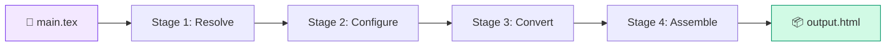
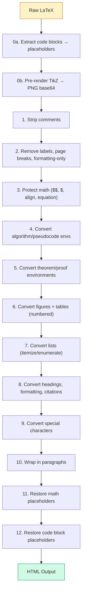
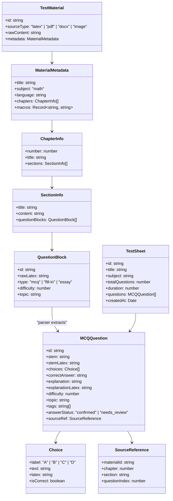
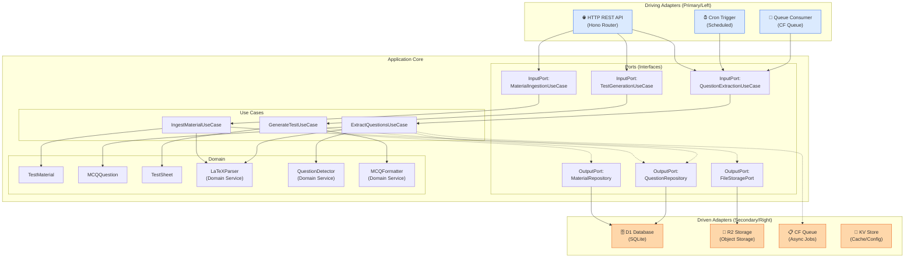
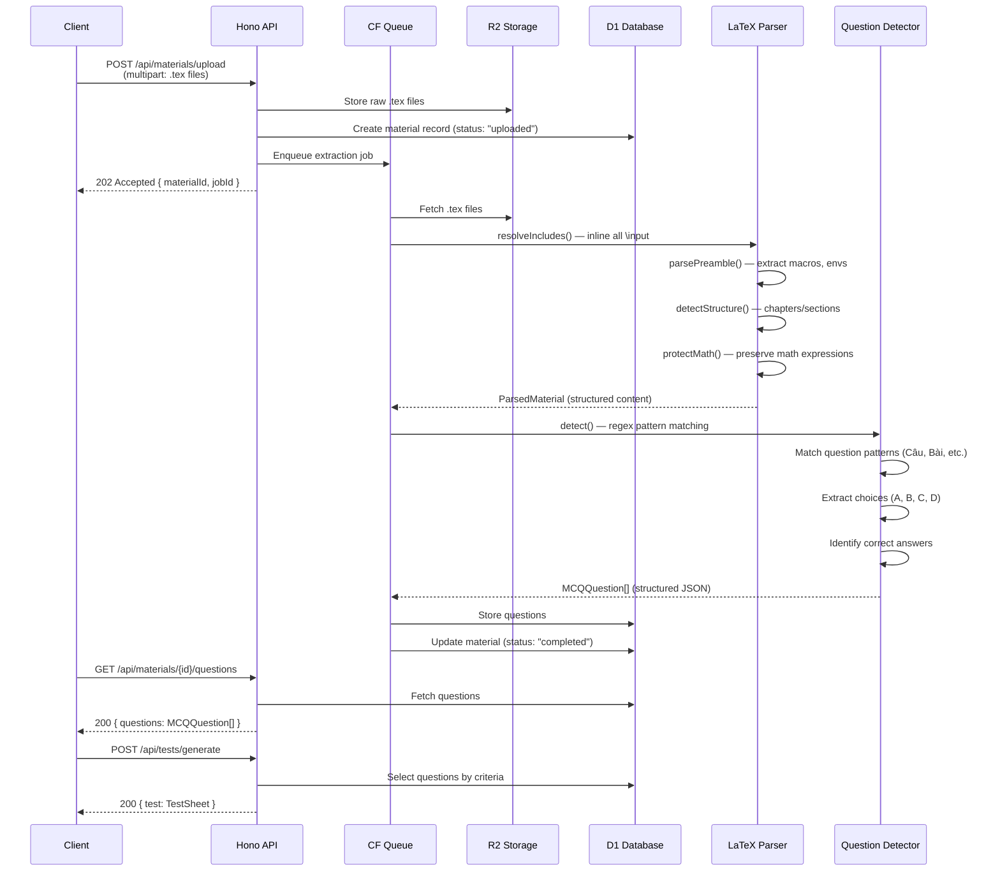

# Porting `latex-book-to-html` to Cloudflare Workers — Multi-Format MCQ Test Generator

> **Goal**: Port the LaTeX parsing and conversion logic from the Python `latex-book-to-html` codebase into a Cloudflare Worker (TypeScript) that ingests math test materials (`.tex`, `PDF`, `DOCX`, images) and produces structured Multiple-Choice Questions (MCQ) as JSON — using deterministic extraction rules, with the Python codebase as the reference source for LaTeX behavior.

---

## Part 0 — Plan Update (2026-02-24)

This revision supersedes earlier assumptions and sets final constraints:

1. **Ingestion formats**: `latex`, `pdf`, `docx`, `image` are first-class sources.
2. **Canonical extraction path**:
   - `latex` keeps deterministic parsing logic ported from Python (`resolve_tex.py`, `tex2html.py`).
   - `pdf`/`docx`/`image` go through a **normalization step** that emits canonical LaTeX-like text blocks before question detection.
3. **Reference implementation**: existing Python project at `/Users/khangvt/projects/latex-book-to-html` remains the source of truth for LaTeX parsing behavior and test fixtures.
4. **Job API canonical path**: `GET /api/jobs/:id` only.
5. **Unknown correct answers**: never default to `A`; store with `answer_status = 'needs_review'`.
6. **Security**: API key auth via KV is mandatory in v1.

## Part 0.1 — Execution Snapshot (2026-02-24)

Current implementation status in this repository:

| Phase | Status | Notes |
|------|--------|-------|
| Phase 1: Core Infrastructure | Completed | Worker, bindings, migrations, entities/ports skeleton, typecheck/tests passing |
| Phase 2: LaTeX Parser Port | Not started | Parser services and parser test suite are not in current `src/` and `tests/` |
| Phase 3: Detection + Async Processing | Partially complete | Queue-backed normalization flow exists for `pdf`/`docx`/`image`; detector/formatter/storage flow pending |
| Phase 4: API + Security + Polish | Partially complete | Extraction job APIs exist under `/api/extraction/jobs*`; broader API/auth contract pending |
| Phase 5: Accuracy Hardening | Planned | No implementation yet |

Immediate next actions (execution order):
1. Finish Phase 4 API contract alignment: API key auth, canonical jobs route, upload contract compatibility.
2. Implement Phase 2 parser port needed for deterministic `latex` path.
3. Complete Phase 3 detector/formatter + D1 persistence.
4. Execute Phase 5 accuracy hardening and metrics.

## Part 1 — Deep Codebase Analysis

### 1.1 Project Overview

| Property | Value |
|----------|-------|
| **Language** | Python 3.8+ |
| **Total LOC** | ~5,086 (4 modules + tests) |
| **Entry Point** | [book2html.py](file:///Users/khangvt/projects/latex-book-to-html/book2html.py) → `tex2html_book.cli.main()` |
| **Package** | `tex2html_book` under [src/](file:///Users/khangvt/projects/latex-book-to-html/src/tex2html_book) |
| **Dependencies** | Pure Python (stdlib only — `re`, `os`, `json`, `base64`, `tempfile`, `subprocess`) |
| **Output** | Single self-contained HTML file with embedded KaTeX, images (base64), and JavaScript |

### 1.2 Architecture — 4 Stage Pipeline



#### Stage 1 — Resolve ([resolve_tex.py](file:///Users/khangvt/projects/latex-book-to-html/src/tex2html_book/resolve_tex.py), 879 lines)

Reads a LaTeX project from `main.tex`, recursively inlines all `\input` / `\include` / `\subimport` commands, and produces a [ResolvedProject](file:///Users/khangvt/projects/latex-book-to-html/src/tex2html_book/resolve_tex.py#L48-L109) data object.

**Key Functions:**

| Function | Source | Purpose |
|----------|--------|---------|
| `resolve_project()` | [L521–636](file:///Users/khangvt/projects/latex-book-to-html/src/tex2html_book/resolve_tex.py#L521-L636) | Main entry — resolves full project into `ResolvedProject` |
| `resolve_includes()` | [L155–243](file:///Users/khangvt/projects/latex-book-to-html/src/tex2html_book/resolve_tex.py#L155-L243) | Recursive include inlining (handles `\input`, `\include`, `\subimport`) |
| `_parse_preamble()` | [L249–394](file:///Users/khangvt/projects/latex-book-to-html/src/tex2html_book/resolve_tex.py#L249-L394) | Extracts metadata: docclass, title, author, bib, environments, KaTeX macros |
| `_detect_structure()` | [L420–495](file:///Users/khangvt/projects/latex-book-to-html/src/tex2html_book/resolve_tex.py#L420-L495) | Splits body into `\part` / `\chapter` / `\section` hierarchy |
| `_strip_tex_comments()` | [L115–122](file:///Users/khangvt/projects/latex-book-to-html/src/tex2html_book/resolve_tex.py#L115-L122) | Remove LaTeX `%` comments |
| `_resolve_file_path()` | [L125–152](file:///Users/khangvt/projects/latex-book-to-html/src/tex2html_book/resolve_tex.py#L125-L152) | Find `.tex` file given a reference |
| `generate_config()` | [L683–745](file:///Users/khangvt/projects/latex-book-to-html/src/tex2html_book/resolve_tex.py#L683-L745) | Creates JSON config dict from resolved project |

**[ResolvedProject](file:///Users/khangvt/projects/latex-book-to-html/src/tex2html_book/resolve_tex.py#L48-L109) Data Model** (defined at [L48](file:///Users/khangvt/projects/latex-book-to-html/src/tex2html_book/resolve_tex.py#L48), fields at [L51–69](file:///Users/khangvt/projects/latex-book-to-html/src/tex2html_book/resolve_tex.py#L51-L69)):

```
ResolvedProject
├── root_dir: str               # Project root directory
├── main_tex: str               # Path to main.tex
├── docclass: str               # "book", "article", "report"
├── title, subtitle, author, date: str
├── preamble: str               # Everything before \begin{document}
├── body: str                   # Everything inside document env
├── parts: List[{num, name, chapters}]
├── chapters: List[{num, title, content, source}]
├── bib_file: str               # Path to .bib bibliography
├── images_dirs: List[str]      # Directories for \includegraphics
├── custom_envs: Dict           # Custom theorem/tcolorbox environments
├── katex_macros: Dict          # LaTeX macro → KaTeX definition
└── tikz_preamble: str          # Extra preamble for TikZ
```

#### Stage 2 — Configure ([cli.py](file:///Users/khangvt/projects/latex-book-to-html/src/tex2html_book/cli.py))

Bridges the `ResolvedProject` into a [Config](file:///Users/khangvt/projects/latex-book-to-html/src/tex2html_book/tex2html.py#L136-L368) object and an assemble config dict. Key functions:

| Function | Source | Purpose |
|----------|--------|---------|
| `project_to_config()` | [cli.py L50–104](file:///Users/khangvt/projects/latex-book-to-html/src/tex2html_book/cli.py#L50-L104) | Converts `ResolvedProject` → `Config` + assemble dict |
| `_ensure_assemble_config()` | [cli.py L283–315](file:///Users/khangvt/projects/latex-book-to-html/src/tex2html_book/cli.py#L283-L315) | Fills required config keys with defaults |
| `Config` class | [tex2html.py L136–368](file:///Users/khangvt/projects/latex-book-to-html/src/tex2html_book/tex2html.py#L136-L368) | Config data class with `from_json()`, `resolve_environments()` |
| `Config.__init__()` | [tex2html.py L139–155](file:///Users/khangvt/projects/latex-book-to-html/src/tex2html_book/tex2html.py#L139-L155) | Default config values (language, environments, etc.) |

#### Stage 3 — Convert ([tex2html.py](file:///Users/khangvt/projects/latex-book-to-html/src/tex2html_book/tex2html.py), 2540 lines)

The **core conversion engine** — transforms raw LaTeX content into HTML card fragments. This is the largest and most complex module.

**The [latex_to_html()](file:///Users/khangvt/projects/latex-book-to-html/src/tex2html_book/tex2html.py#L1669-L1966) Pipeline — 12 Steps:**



**Key Conversion Functions (all regex-based, in [tex2html.py](file:///Users/khangvt/projects/latex-book-to-html/src/tex2html_book/tex2html.py)):**

| Function | Source | What It Converts |
|----------|--------|-----------------|
| `protect_math()` | [L377–450](file:///Users/khangvt/projects/latex-book-to-html/src/tex2html_book/tex2html.py#L377-L450) | Saves math expressions to a store, replaces with placeholders |
| `restore_math()` | [L453–466](file:///Users/khangvt/projects/latex-book-to-html/src/tex2html_book/tex2html.py#L453-L466) | Restores math placeholders after all processing |
| `strip_comments()` | [L472–479](file:///Users/khangvt/projects/latex-book-to-html/src/tex2html_book/tex2html.py#L472-L479) | Removes `%...` line comments |
| `split_into_sections()` | [L485–536](file:///Users/khangvt/projects/latex-book-to-html/src/tex2html_book/tex2html.py#L485-L536) | Splits chapter by `\section{}` into (title, content) pairs |
| `convert_environments()` | [L542–611](file:///Users/khangvt/projects/latex-book-to-html/src/tex2html_book/tex2html.py#L542-L611) | `\begin{theorem}...\end{theorem}` → styled HTML divs |
| `convert_tabular()` | [L697–717](file:///Users/khangvt/projects/latex-book-to-html/src/tex2html_book/tex2html.py#L697-L717) | `tabular` / `longtable` → `<table>` |
| `convert_lists()` | [L723–796](file:///Users/khangvt/projects/latex-book-to-html/src/tex2html_book/tex2html.py#L723-L796) | `itemize` / `enumerate` / `description` → `<ul>`/`<ol>`/`<dl>` |
| `_number_headings()` | [L802–846](file:///Users/khangvt/projects/latex-book-to-html/src/tex2html_book/tex2html.py#L802-L846) | `\subsection` etc. → `<h4>`...`<h6>` with numbering |
| `extract_code_environments()` | [L852–973](file:///Users/khangvt/projects/latex-book-to-html/src/tex2html_book/tex2html.py#L852-L973) | `verbatim` / `lstlisting` / `minted` → syntax-highlighted HTML |
| `convert_algorithm_environments()` | [L1261–1363](file:///Users/khangvt/projects/latex-book-to-html/src/tex2html_book/tex2html.py#L1261-L1363) | `algorithmic` / `algorithm2e` → styled pseudocode |
| `convert_tikz_environments()` | [L1369–1492](file:///Users/khangvt/projects/latex-book-to-html/src/tex2html_book/tex2html.py#L1369-L1492) | TikZ diagrams → pre-rendered PNG |
| `convert_includegraphics()` | [L1563–1666](file:///Users/khangvt/projects/latex-book-to-html/src/tex2html_book/tex2html.py#L1563-L1666) | `\includegraphics` → `` with base64 |
| `generate_card_html()` | [L1979–2012](file:///Users/khangvt/projects/latex-book-to-html/src/tex2html_book/tex2html.py#L1979-L2012) | Wraps content in a navigable card div |
| `process_chapter()` | [L2127–2212](file:///Users/khangvt/projects/latex-book-to-html/src/tex2html_book/tex2html.py#L2127-L2212) | Orchestrates per-chapter conversion |

**Orchestrator:** The [run()](file:///Users/khangvt/projects/latex-book-to-html/src/tex2html_book/cli.py#L321-L462) function in `cli.py` coordinates [convert_project_to_cards()](file:///Users/khangvt/projects/latex-book-to-html/src/tex2html_book/cli.py#L110-L206) which iterates chapters and calls `latex_to_html()` per section.

#### Stage 4 — Assemble ([assemble.py](file:///Users/khangvt/projects/latex-book-to-html/src/tex2html_book/assemble.py), 1112 lines)

Takes the generated HTML card fragments plus metadata and injects them into a **skeleton HTML template** ([skeleton.html](file:///Users/khangvt/projects/latex-book-to-html/src/tex2html_book/data/skeleton.html), ~1.7 MB). Key functions: [assemble()](file:///Users/khangvt/projects/latex-book-to-html/src/tex2html_book/assemble.py#L986-L1064), [replace_placeholders()](file:///Users/khangvt/projects/latex-book-to-html/src/tex2html_book/assemble.py#L818-L844), [build_header()](file:///Users/khangvt/projects/latex-book-to-html/src/tex2html_book/assemble.py#L170-L238), [build_sidebar()](file:///Users/khangvt/projects/latex-book-to-html/src/tex2html_book/assemble.py#L327-L434), [parse_bib()](file:///Users/khangvt/projects/latex-book-to-html/src/tex2html_book/assemble.py#L684-L768).

Uses `__PLACEHOLDER__` markers in the skeleton template:

| Placeholder | Builder Function |
|-------------|------------------|
| `__TITLE__` | Config title |
| `__HEADER_HTML__` | [build_header()](file:///Users/khangvt/projects/latex-book-to-html/src/tex2html_book/assemble.py#L170-L238) — title, author, tab buttons |
| `__ABOUT_HTML__` | [build_about_modal()](file:///Users/khangvt/projects/latex-book-to-html/src/tex2html_book/assemble.py#L245-L320) |
| `__SIDEBAR_HTML__` | [build_sidebar()](file:///Users/khangvt/projects/latex-book-to-html/src/tex2html_book/assemble.py#L327-L434) — navigation panels |
| `__CARDS_HTML__` | All card HTML fragments concatenated |
| `__TAB_CONFIG__` | [build_tab_config()](file:///Users/khangvt/projects/latex-book-to-html/src/tex2html_book/assemble.py#L469-L566) |
| `__KATEX_MACROS__` | [build_katex_macros()](file:///Users/khangvt/projects/latex-book-to-html/src/tex2html_book/assemble.py#L596-L610) |
| `__REFS__` | [build_refs_js()](file:///Users/khangvt/projects/latex-book-to-html/src/tex2html_book/assemble.py#L775-L790) |
| `__REFS_URLS__` | [build_refs_urls_js()](file:///Users/khangvt/projects/latex-book-to-html/src/tex2html_book/assemble.py#L797-L808) |

### 1.3 Key Architectural Observations

1. **Pure regex-based parsing** — No AST is built. All LaTeX-to-HTML conversions use `re.sub()` with replacement callbacks. This is ~90% of the codebase complexity.
2. **Stateful counters** — Figure, table, and environment counters are shared across sections within a chapter via mutable `[n]` lists.
3. **Self-contained output** — The skeleton embeds ~1.7 MB of KaTeX CSS+JS, plus all images as base64. An "online" mode swaps these for CDN links.
4. **Vietnamese-first** — Default labels, captions ("Hình", "Bảng"), and proof labels are Vietnamese.
5. **No external dependencies** — The only optional external tools are `xelatex` + `pdftoppm` for TikZ rendering.
6. **Card metaphor** — Each `\section{}` becomes a navigable "card" with metadata (sequential number, chapter, difficulty, bilingual titles).

### 1.4 What's Relevant vs. Irrelevant for MCQ Generation

| Component | Relevant? | Source Reference |
|-----------|-----------|------------------|
| Include resolution | ✅ **Yes** | [resolve_includes() L155](file:///Users/khangvt/projects/latex-book-to-html/src/tex2html_book/resolve_tex.py#L155-L243) — parse multi-file projects |
| Preamble parsing | ✅ **Yes** | [_parse_preamble() L249](file:///Users/khangvt/projects/latex-book-to-html/src/tex2html_book/resolve_tex.py#L249-L394) — extract macros, environments |
| Structure detection | ✅ **Yes** | [_detect_structure() L420](file:///Users/khangvt/projects/latex-book-to-html/src/tex2html_book/resolve_tex.py#L420-L495) — chapters/sections/problems |
| Math protection | ✅ **Yes** | [protect_math() L377](file:///Users/khangvt/projects/latex-book-to-html/src/tex2html_book/tex2html.py#L377-L450) — preserve math in MCQ content |
| Environment conversion | ✅ **Yes** | [convert_environments() L542](file:///Users/khangvt/projects/latex-book-to-html/src/tex2html_book/tex2html.py#L542-L611) — detect question/answer blocks |
| List conversion | ✅ **Yes** | [convert_lists() L723](file:///Users/khangvt/projects/latex-book-to-html/src/tex2html_book/tex2html.py#L723-L796) — MCQ choices are often `\begin{enumerate}` |
| Table conversion | ⚠️ Partial | [convert_tabular() L697](file:///Users/khangvt/projects/latex-book-to-html/src/tex2html_book/tex2html.py#L697-L717) — only if questions contain tables |
| TikZ rendering | ❌ **No** | [convert_tikz_environments() L1369](file:///Users/khangvt/projects/latex-book-to-html/src/tex2html_book/tex2html.py#L1369-L1492) — requires `xelatex` |
| Image embedding | ❌ **No** | [convert_includegraphics() L1563](file:///Users/khangvt/projects/latex-book-to-html/src/tex2html_book/tex2html.py#L1563-L1666) — MCQs ref images, not embed |
| HTML skeleton/sidebar | ❌ **No** | [assemble.py](file:///Users/khangvt/projects/latex-book-to-html/src/tex2html_book/assemble.py) — output is JSON, not HTML |
| Card/tab/navigation | ❌ **No** | [generate_card_html() L1979](file:///Users/khangvt/projects/latex-book-to-html/src/tex2html_book/tex2html.py#L1979-L2012) — different UI paradigm |

---

## Part 2 — Cloudflare Worker Architecture (DDD + Hexagonal)

### 2.1 Domain Model (Domain-Driven Design)



### 2.2 Hexagonal Architecture



### 2.3 Cloudflare Tech Stack Mapping

| Need | Cloudflare Service | Notes |
|------|-------------------|-------|
| **Compute** | Cloudflare Worker | TypeScript, Hono framework |
| **Database** | D1 (SQLite) | Questions, tests, materials metadata |
| **File Storage** | R2 (S3-compatible) | Raw uploads (`.tex`, `pdf`, `docx`, images, manifests) |
| **Async Jobs** | Queues | Long-running extraction tasks for large projects |
| **Config/Cache** | KV | Macro templates, parser config cache |
| **Cron** | Scheduled Workers | Cleanup, batch re-processing |
| **API Framework** | Hono | Lightweight, Workers-native |
| **Validation** | Zod | Schema validation for API inputs/outputs |
| **Normalization Worker** | Python service (HTTP) | Converts `pdf`/`docx`/`image` to canonical extraction text |

> [!NOTE]
> **Deterministic extraction remains mandatory.** OCR/document normalization is permitted for non-LaTeX inputs, but question detection and answer extraction use deterministic rules only.

---

## Part 3 — Detailed Design

### 3.1 Project Structure

```
mcq-generator/
├── wrangler.toml                    # Cloudflare Worker config
├── package.json
├── tsconfig.json
├── src/
│   ├── index.ts                     # Worker entry point (Hono app)
│   │
│   ├── domain/                      # 🟢 Domain Layer (pure logic, no deps)
│   │   ├── entities/
│   │   │   ├── TestMaterial.ts
│   │   │   ├── MCQQuestion.ts
│   │   │   ├── Choice.ts
│   │   │   ├── TestSheet.ts
│   │   │   └── QuestionBlock.ts
│   │   ├── value-objects/
│   │   │   ├── MaterialMetadata.ts
│   │   │   ├── ChapterInfo.ts
│   │   │   ├── SectionInfo.ts
│   │   │   ├── SourceReference.ts
│   │   │   └── Difficulty.ts
│   │   └── services/
│   │       ├── LaTeXParser.ts       # ← Ported from resolve_tex.py + tex2html.py
│   │       ├── QuestionDetector.ts  # ← Identifies question blocks in content
│   │       └── MCQFormatter.ts      # ← Formats extracted content into MCQ JSON
│   │
│   ├── application/                 # 🔵 Application Layer (use cases)
│   │   ├── ports/
│   │   │   ├── input/
│   │   │   │   ├── IngestMaterialPort.ts
│   │   │   │   ├── ExtractQuestionsPort.ts
│   │   │   │   └── GenerateTestPort.ts
│   │   │   └── output/
│   │   │       ├── MaterialRepository.ts
│   │   │       ├── QuestionRepository.ts
│   │   │       ├── FileStoragePort.ts
│   │   │       └── NormalizationPort.ts
│   │   └── use-cases/
│   │       ├── IngestMaterialUseCase.ts
│   │       ├── ExtractQuestionsUseCase.ts
│   │       └── GenerateTestUseCase.ts
│   │
│   ├── infrastructure/             # 🟠 Infrastructure Layer (adapters)
│   │   ├── persistence/
│   │   │   ├── D1MaterialRepository.ts
│   │   │   └── D1QuestionRepository.ts
│   │   ├── storage/
│   │   │   └── R2FileStorage.ts
│   │   ├── queue/
│   │   │   └── CFQueueAdapter.ts
│   │   ├── cache/
│   │   │   └── KVCacheAdapter.ts
│   │   └── normalization/
│   │       └── HttpNormalizationClient.ts
│   │
│   ├── adapters/                   # 🔴 Driving Adapters
│   │   ├── http/
│   │   │   ├── routes/
│   │   │   │   ├── materials.ts
│   │   │   │   ├── questions.ts
│   │   │   │   └── tests.ts
│   │   │   ├── middleware/
│   │   │   │   ├── auth.ts
│   │   │   │   ├── validation.ts
│   │   │   │   └── error-handler.ts
│   │   │   └── schemas/
│   │   │       ├── material.schema.ts
│   │   │       ├── question.schema.ts
│   │   │       └── test.schema.ts
│   │   ├── queue/
│   │   │   └── extraction-consumer.ts
│   │   └── cron/
│   │       └── scheduled-handler.ts
│   │
│   └── shared/                     # Shared utilities
│       ├── types.ts
│       ├── errors.ts
│       └── config.ts
│
├── migrations/                     # D1 schema migrations
│   ├── 0001_create_materials.sql
│   ├── 0002_create_questions.sql
│   └── 0003_create_tests.sql
│
└── tests/
    ├── domain/
    │   ├── latex-parser.test.ts
    │   ├── question-detector.test.ts
    │   └── mcq-formatter.test.ts
    ├── application/
    │   └── use-cases.test.ts
    └── fixtures/
        ├── sample-math.tex
        └── expected-output.json
```

### 3.2 Domain Service: `LaTeXParser` — Porting Strategy

This is the most critical component — it ports the core logic from [resolve_tex.py](file:///Users/khangvt/projects/latex-book-to-html/src/tex2html_book/resolve_tex.py) and [tex2html.py](file:///Users/khangvt/projects/latex-book-to-html/src/tex2html_book/tex2html.py) into TypeScript.

> [!IMPORTANT]
> We do **NOT** port the HTML generation logic. Instead, the parser extracts **structured content** from LaTeX, preserving math expressions in their original LaTeX form for client-side KaTeX rendering.

**What to port from the Python codebase:**

| Python Function | Source | → TypeScript | Purpose |
|----------------|--------|--------------|--------|
| `resolve_includes()` | [resolve_tex.py L155](file:///Users/khangvt/projects/latex-book-to-html/src/tex2html_book/resolve_tex.py#L155-L243) | `resolveIncludes()` | Recursive `\input` inlining |
| `_strip_tex_comments()` | [resolve_tex.py L115](file:///Users/khangvt/projects/latex-book-to-html/src/tex2html_book/resolve_tex.py#L115-L122) | `stripComments()` | Remove `%` comments |
| `_parse_preamble()` | [resolve_tex.py L249](file:///Users/khangvt/projects/latex-book-to-html/src/tex2html_book/resolve_tex.py#L249-L394) | `parsePreamble()` | Extract macros, environments |
| `_detect_structure()` | [resolve_tex.py L420](file:///Users/khangvt/projects/latex-book-to-html/src/tex2html_book/resolve_tex.py#L420-L495) | `detectStructure()` | Find chapters/sections |
| `split_into_sections()` | [tex2html.py L485](file:///Users/khangvt/projects/latex-book-to-html/src/tex2html_book/tex2html.py#L485-L536) | `splitIntoSections()` | Section-level splitting |
| `protect_math()` | [tex2html.py L377](file:///Users/khangvt/projects/latex-book-to-html/src/tex2html_book/tex2html.py#L377-L450) | `protectMath()` | Math expression preservation |
| `restore_math()` | [tex2html.py L453](file:///Users/khangvt/projects/latex-book-to-html/src/tex2html_book/tex2html.py#L453-L466) | `restoreMath()` | Restore math after processing |
| `convert_lists()` | [tex2html.py L723](file:///Users/khangvt/projects/latex-book-to-html/src/tex2html_book/tex2html.py#L723-L796) | `parseLists()` | Extract list items (MCQ choices!) |
| `convert_environments()` | [tex2html.py L542](file:///Users/khangvt/projects/latex-book-to-html/src/tex2html_book/tex2html.py#L542-L611) | `parseEnvironments()` | Detect theorem/problem blocks |
| `strip_comments()` | [tex2html.py L472](file:///Users/khangvt/projects/latex-book-to-html/src/tex2html_book/tex2html.py#L472-L479) | `stripComments()` | Remove `%...` line comments |

**What NOT to port:**

| Skip | Source | Why |
|------|--------|----- |
| TikZ rendering | [tex2html.py L1369](file:///Users/khangvt/projects/latex-book-to-html/src/tex2html_book/tex2html.py#L1369-L1492) | Requires `xelatex` binary |
| Image base64 embedding | [tex2html.py L1563](file:///Users/khangvt/projects/latex-book-to-html/src/tex2html_book/tex2html.py#L1563-L1666) | MCQs reference images, not embed |
| HTML card generation | [tex2html.py L1979](file:///Users/khangvt/projects/latex-book-to-html/src/tex2html_book/tex2html.py#L1979-L2012) | Output is JSON, not HTML |
| Skeleton / sidebar / tabs | [assemble.py](file:///Users/khangvt/projects/latex-book-to-html/src/tex2html_book/assemble.py) | Different output paradigm |
| Algorithm pseudocode | [tex2html.py L1261](file:///Users/khangvt/projects/latex-book-to-html/src/tex2html_book/tex2html.py#L1261-L1363) | Not relevant to MCQ extraction |

**Ported `LaTeXParser` interface:**

```typescript
interface ParsedMaterial {
  metadata: {
    title: string;
    author: string;
    subject: string;
    macros: Record<string, string>;
    customEnvironments: Record<string, EnvironmentDef>;
  };
  chapters: ParsedChapter[];
}

interface ParsedChapter {
  number: number;
  title: string;
  sections: ParsedSection[];
}

interface ParsedSection {
  title: string;
  rawLatex: string;          // Original LaTeX source
  textContent: string;       // Cleaned text (comments stripped, macros expanded)
  mathExpressions: MathExpr[];  // Extracted math with positions
  lists: ParsedList[];       // Extracted list structures (→ MCQ choices)
  environments: ParsedEnv[]; // Theorem/problem/example blocks
}

interface MathExpr {
  type: 'inline' | 'display' | 'equation' | 'align';
  latex: string;
  position: { start: number; end: number };
}
```

### 3.3 Domain Service: `QuestionDetector`

This is **new logic** not present in the original codebase. It identifies question blocks within parsed content:

```typescript
class QuestionDetector {
  /**
   * Detection strategies (in order) — all regex-based, no AI:
   * 1. Explicit exam environments: \begin{questions}, \begin{exercise}
   * 2. Numbered items with answer choices: "Câu 1:", "Question 1:"
   * 3. Enumerate lists with choice sub-lists (a), (b), (c), (d)
   * 4. Fallback: heuristic paragraph splitting for unstructured content
   */
  detect(section: ParsedSection): QuestionBlock[];
}
```

**Pattern matching for Vietnamese math tests:**

```typescript
const QUESTION_PATTERNS = [
  /^Câu\s+(\d+)[.:]\s*/m,              // "Câu 1:"
  /^Bài\s+(\d+)[.:]\s*/m,              // "Bài 1:"
  /^Question\s+(\d+)[.:]\s*/m,         // "Question 1:"
  /\\item\s*\(?([A-Da-d])\)?\s*/,       // \item (A)
  /^([A-D])[.)]\s+/m,                  // A. choice
];

const ANSWER_KEY_PATTERNS = [
  /Đáp\s+án[:\s]+([A-D])/,             // "Đáp án: B"
  /Answer[:\s]+([A-D])/i,              // "Answer: C"
  /\\textbf\{([A-D])\}/,               // \textbf{A}
];
```

### 3.4 Processing Flow



> [!NOTE]
> The entire pipeline is **deterministic** — no AI calls, no network latency for inference. Parsing a typical LaTeX test file completes in milliseconds within the Worker's CPU budget.

### 3.5 D1 Database Schema

```sql
-- Materials table
CREATE TABLE materials (
    id TEXT PRIMARY KEY,
    title TEXT,
    source_type TEXT NOT NULL CHECK(source_type IN ('latex', 'pdf', 'docx', 'image')),
    status TEXT NOT NULL DEFAULT 'uploaded'
        CHECK(status IN ('uploaded', 'normalizing', 'processing', 'completed', 'failed')),
    r2_key TEXT NOT NULL,
    manifest_key TEXT,
    metadata TEXT,  -- JSON: MaterialMetadata
    error_message TEXT,
    created_at TEXT NOT NULL DEFAULT (datetime('now')),
    updated_at TEXT NOT NULL DEFAULT (datetime('now'))
);

-- Questions table
CREATE TABLE questions (
    id TEXT PRIMARY KEY,
    material_id TEXT NOT NULL REFERENCES materials(id),
    stem TEXT NOT NULL,
    stem_latex TEXT NOT NULL,
    choices TEXT NOT NULL,        -- JSON: Choice[]
    correct_answer TEXT CHECK(correct_answer IN ('A', 'B', 'C', 'D')),
    answer_status TEXT NOT NULL DEFAULT 'needs_review'
        CHECK(answer_status IN ('confirmed', 'needs_review')),
    explanation TEXT,
    explanation_latex TEXT,
    difficulty INTEGER NOT NULL CHECK(difficulty BETWEEN 1 AND 10),
    topic TEXT,
    tags TEXT,                    -- JSON: string[]
    source_chapter INTEGER,
    source_section TEXT,
    source_question_index INTEGER,
    created_at TEXT NOT NULL DEFAULT (datetime('now'))
);

-- Test sheets table
CREATE TABLE test_sheets (
    id TEXT PRIMARY KEY,
    title TEXT NOT NULL,
    subject TEXT NOT NULL DEFAULT 'math',
    total_questions INTEGER NOT NULL,
    duration_minutes INTEGER,
    question_ids TEXT NOT NULL,   -- JSON: string[]
    created_at TEXT NOT NULL DEFAULT (datetime('now'))
);

-- Extraction jobs table
CREATE TABLE extraction_jobs (
    id TEXT PRIMARY KEY,
    material_id TEXT NOT NULL REFERENCES materials(id),
    status TEXT NOT NULL DEFAULT 'pending'
        CHECK(status IN ('pending', 'processing', 'completed', 'failed')),
    progress INTEGER DEFAULT 0,
    result TEXT,                  -- JSON: extraction result summary
    error TEXT,
    started_at TEXT,
    completed_at TEXT,
    created_at TEXT NOT NULL DEFAULT (datetime('now'))
);

-- Indexes
CREATE INDEX idx_questions_material ON questions(material_id);
CREATE INDEX idx_questions_topic ON questions(topic);
CREATE INDEX idx_questions_difficulty ON questions(difficulty);
CREATE INDEX idx_jobs_material ON extraction_jobs(material_id);
CREATE INDEX idx_jobs_status ON extraction_jobs(status);
```

### 3.6 API Endpoints

| Method | Path | Description | Input | Output |
|--------|------|-------------|-------|--------|
| `POST` | `/api/materials/upload` | Upload source files (`.tex` / `pdf` / `docx` / images) | `multipart/form-data` (`files[]`, optional `mainFile`) | `{ materialId, jobId }` |
| `GET` | `/api/materials` | List all materials | Query params | `{ materials: Material[] }` |
| `GET` | `/api/materials/:id` | Get material details | — | `{ material, job }` |
| `GET` | `/api/materials/:id/questions` | Get extracted questions | Query params | `{ questions: MCQQuestion[] }` |
| `POST` | `/api/materials/:id/retry` | Retry failed extraction | — | `{ jobId }` |
| `DELETE` | `/api/materials/:id` | Delete material & questions | — | `{ deleted: true }` |
| `GET` | `/api/questions` | Search/filter questions | Query params | `{ questions: MCQQuestion[] }` |
| `GET` | `/api/questions/:id` | Get single question | — | `{ question: MCQQuestion }` |
| `PATCH` | `/api/questions/:id` | Edit a question | JSON body | `{ question: MCQQuestion }` |
| `POST` | `/api/tests/generate` | Generate a test sheet | `{ criteria }` | `{ test: TestSheet }` |
| `GET` | `/api/tests` | List all tests | Query params | `{ tests: TestSheet[] }` |
| `GET` | `/api/tests/:id` | Get test with questions | — | `{ test, questions }` |
| `GET` | `/api/jobs/:id` | Check job status | — | `{ job }` |

### 3.7 Design Philosophy: Deterministic Extraction (No AI Question Generation)

Following the original Python codebase's architecture, question extraction uses deterministic rule-based parsing. Non-LaTeX ingestion may use OCR/normalization, but question detection and answer extraction stay deterministic.

**Why deterministic extraction?**
- LaTeX input is already machine-readable, structured text
- Questions, choices, and answers follow well-defined LaTeX patterns
- Regex parsing is deterministic, fast, and free (no API costs, no rate limits)
- Results are reproducible — same input always produces same output
- Minimal runtime variance for extraction logic

**What the parser handles natively:**

| Input Pattern | Extraction Method |
|--------------|------------------|
| `\begin{enumerate}` with `\item` | `parseLists()` — regex split on `\item` |
| `Câu 1:`, `Bài 2.` | `detectQuestions()` — Vietnamese question patterns |
| `A.`, `B.`, `C.`, `D.` choices | `extractChoices()` — alphabetical pattern matching |
| `Đáp án: B`, `\textbf{C}` | `detectCorrectAnswer()` — answer key patterns |
| `$x^2 + 3x - 4 = 0$` | `protectMath()` — preserved as-is for client rendering |
| `\begin{theorem}...` | `parseEnvironments()` — context/reference material |
| `\section{Phần I}` | `detectStructure()` — test section boundaries |

For non-LaTeX inputs:
- `pdf`/`docx`/`image` are normalized first into canonical text blocks.
- deterministic detector/formatter stays unchanged after normalization.

### 3.8 `wrangler.toml` Configuration

```toml
name = "mcq-generator"
main = "src/index.ts"
compatibility_date = "2024-12-01"

[vars]
ENVIRONMENT = "production"
NORMALIZER_URL = "https://normalizer.example.com"

[[d1_databases]]
binding = "DB"
database_name = "mcq-generator-db"
database_id = "<your-d1-database-id>"

[[r2_buckets]]
binding = "STORAGE"
bucket_name = "mcq-materials"

[[queues.producers]]
binding = "EXTRACTION_QUEUE"
queue = "extraction-jobs"

[[queues.consumers]]
queue = "extraction-jobs"
max_batch_size = 1
max_retries = 3
dead_letter_queue = "extraction-dlq"

[[kv_namespaces]]
binding = "CACHE"
id = "<your-kv-namespace-id>"

[[triggers.crons]]
cron = "0 */6 * * *"
```

`NORMALIZER_TOKEN` should be stored as a Worker secret:

```bash
wrangler secret put NORMALIZER_TOKEN
```

---

## Part 4 — Implementation Priorities

### Phase 1: Core Infrastructure (Week 1)
1. Scaffold Cloudflare Worker project with Hono
2. Set up D1 database with migrations
3. Set up R2 storage bucket
4. Implement domain entities and value objects (multi-source aware)
5. Implement hexagonal ports/interfaces

### Phase 2: LaTeX Parser Port (Week 2)
1. Port `stripComments()`, `resolveIncludes()` from `resolve_tex.py`
2. Port `parsePreamble()`, `detectStructure()` from `resolve_tex.py`
3. Port `protectMath()`, `restoreMath()` from `tex2html.py`
4. Port `splitIntoSections()`, `parseLists()` from `tex2html.py`
5. Port `parseEnvironments()` from `tex2html.py`
6. **Test extensively with math test LaTeX files**

### Phase 3: Multi-Format Normalization + Question Detection (Week 3)
1. Add normalization adapter for `pdf`/`docx`/`image` inputs
2. Persist normalization artifacts + mapping metadata
3. Implement `QuestionDetector` with Vietnamese math patterns (regex-based)
4. Implement `MCQFormatter` — structures detected questions into JSON
5. Implement answer key extraction (bold/underline/explicit patterns)
6. Wire up Queue-based async processing flow for large files
7. Implement job status tracking

### Phase 4: API + Security + Polish (Week 4)
1. Implement all REST endpoints
2. Add Zod validation schemas
3. Implement error handling and retry logic
4. Add API key auth + rotation via KV
5. Write integration tests
6. Deploy and test end-to-end

### Phase 5: Accuracy Hardening (Week 5)
1. Expand `QuestionDetector` coverage for real-world mixed-format normalization outputs
2. Expand fixtures from Python repo + new PDF/DOCX/image samples
3. Add review tooling for `needs_review` questions
4. Track extraction precision/recall metrics per source type

Detailed phase plan: [phase-5-accuracy-hardening.md](./phase-5-accuracy-hardening.md)

---

## Part 5 — Key Regex Patterns to Port

These are the critical regex patterns from the Python codebase that must be carefully translated to JavaScript/TypeScript:

```typescript
// From resolve_tex.py — Include resolution (see L155–243)
const INPUT_PATTERN = /\\(?:input|include)\{([^}]+)\}/g;
const SUBIMPORT_PATTERN = /\\subimport\{([^}]*)\}\{([^}]+)\}/g;

// From resolve_tex.py — Structure detection (see L420–495)
const CHAPTER_PATTERN = /\\chapter\*?\{((?:[^{}]|\{[^{}]*\})*)\}/g;
const SECTION_PATTERN = /\\section\*?\{((?:[^{}]|\{[^{}]*\})*)\}/g;
const PART_PATTERN = /\\part\*?\{((?:[^{}]|\{[^{}]*\})*)\}/g;

// From tex2html.py — Math protection (see L377–450)
const DISPLAY_MATH = /\$\$([\s\S]*?)\$\$/g;
const DISPLAY_BRACKET = /(?<!\\)\\\[([\s\S]*?)\\]/g;
const INLINE_MATH = /(?<![\\$])\$(?!\$)((?:[^$\\]|\\.)+)\$/g;
const ALIGN_ENV = /\\begin\{(align|equation|gather|multline)\*?\}([\s\S]*?)\\end\{\1\*?\}/g;

// From tex2html.py — Environment detection (see L542–611)
const ENV_PATTERN = (name: string) =>
  new RegExp(`\\\\begin\\{${name}\\}(?:\\[([^\\]]*)\\])?([\\s\\S]*?)\\\\end\\{${name}\\}`, 'g');

// From tex2html.py — List conversion (see L723–796)
const ITEMIZE = /\\begin\{itemize\}([\s\S]*?)\\end\{itemize\}/g;
const ENUMERATE = /\\begin\{enumerate\}([\s\S]*?)\\end\{enumerate\}/g;
const ITEM = /\\item\s*/g;

// NEW — MCQ-specific patterns (no original equivalent)
const QUESTION_NUMBER_VI = /^Câu\s+(\d+)[.:]\s*/gm;
const QUESTION_NUMBER_EN = /^Question\s+(\d+)[.:]\s*/gm;
const CHOICE_PATTERN = /^\s*([A-D])[.)]\s+/gm;
const ANSWER_KEY = /Đáp\s+án[:\s]+([A-D])/g;
```

**Source location cross-reference:**

| Pattern Group | Python Source | Lines |
|--------------|--------------|-------|
| Include resolution | [resolve_tex.py](file:///Users/khangvt/projects/latex-book-to-html/src/tex2html_book/resolve_tex.py#L155-L243) | L155–243 |
| Structure detection | [resolve_tex.py](file:///Users/khangvt/projects/latex-book-to-html/src/tex2html_book/resolve_tex.py#L420-L495) | L420–495 |
| Math protection | [tex2html.py](file:///Users/khangvt/projects/latex-book-to-html/src/tex2html_book/tex2html.py#L377-L450) | L377–450 (see also [L374](file:///Users/khangvt/projects/latex-book-to-html/src/tex2html_book/tex2html.py#L374) for `_MATH_PLACEHOLDER`) |
| Environment detection | [tex2html.py](file:///Users/khangvt/projects/latex-book-to-html/src/tex2html_book/tex2html.py#L542-L611) | L542–611 |
| List conversion | [tex2html.py](file:///Users/khangvt/projects/latex-book-to-html/src/tex2html_book/tex2html.py#L723-L796) | L723–796 |
| Comment stripping | [tex2html.py](file:///Users/khangvt/projects/latex-book-to-html/src/tex2html_book/tex2html.py#L472-L479) | L472–479 |
| Default environments | [tex2html.py](file:///Users/khangvt/projects/latex-book-to-html/src/tex2html_book/tex2html.py#L42-L71) | L42–71 (Vietnamese labels at [L74–112](file:///Users/khangvt/projects/latex-book-to-html/src/tex2html_book/tex2html.py#L74-L112)) |

> [!WARNING]
> JavaScript regex differs from Python in several ways:
> - No `re.DOTALL` flag — use `[\s\S]` instead of `.` with `s` flag
> - Lookbehind support varies (available in modern V8/Workers)
> - Named groups use `(?<name>...)` syntax (same)
> - No `re.VERBOSE` flag — use string concatenation for readability

---

## Verification Plan

### Automated Tests
- **Unit tests** for `LaTeXParser` domain service using Vitest — port test cases from [test_tex2html.py](file:///Users/khangvt/projects/latex-book-to-html/tests/test_tex2html.py) and [test_resolve.py](file:///Users/khangvt/projects/latex-book-to-html/tests/test_resolve.py):
  ```bash
  npx vitest run tests/domain/latex-parser.test.ts
  ```
- **Unit tests** for `QuestionDetector` (new tests, no Python equivalent):
  ```bash
  npx vitest run tests/domain/question-detector.test.ts
  ```
- **Integration tests** for API endpoints using `wrangler dev`:
  ```bash
  wrangler dev --test
  ```

### Test Fixtures
Port the test fixtures from the existing test files:
- Comment stripping: [test_tex2html.py L10–30](file:///Users/khangvt/projects/latex-book-to-html/tests/test_tex2html.py#L10-L30)
- Math protection: [test_tex2html.py L32–55](file:///Users/khangvt/projects/latex-book-to-html/tests/test_tex2html.py#L32-L55)
- Environment conversion: [test_tex2html.py L57–90](file:///Users/khangvt/projects/latex-book-to-html/tests/test_tex2html.py#L57-L90)
- Structure resolution: [test_resolve.py L30–70](file:///Users/khangvt/projects/latex-book-to-html/tests/test_resolve.py#L30-L70)
- Assembly/output: [test_assemble.py](file:///Users/khangvt/projects/latex-book-to-html/tests/test_assemble.py)
- Sample LaTeX project: [examples/minimal-book/](file:///Users/khangvt/projects/latex-book-to-html/examples/minimal-book)

### Manual Verification
1. Upload math test materials (`.tex`, `pdf`, `docx`, image) via the API and verify JSON output
2. Generate a test sheet and verify question/answer correctness
3. Test with Vietnamese math materials specifically

> [!NOTE]
> This document now tracks both planning and execution snapshot. Keep this file and phase docs synchronized after each milestone.
